# Tool Application
> Generated by [`prisma-markdown`](https://github.com/samchon/prisma-markdown)

- [default](#default)

## default

```mermaid
erDiagram
"SynchronizationLog" {
  Int id PK
  DateTime created_at
  String created_by "nullable"
  DateTime updated_at
  String updated_by "nullable"
  DateTime deleted_at "nullable"
  String name
  String description "nullable"
  String category
  Json details "nullable"
  Boolean hasError
  String error "nullable"
}
"AccessPoint" {
  Int id PK
  DateTime created_at
  String created_by "nullable"
  DateTime updated_at
  String updated_by "nullable"
  DateTime deleted_at "nullable"
  String name UK
  String description "nullable"
  Json translations "nullable"
  String sortorder "nullable"
}
"AuditLog" {
  Int id PK
  DateTime created_at
  String created_by "nullable"
  DateTime updated_at
  String updated_by "nullable"
  DateTime deleted_at "nullable"
  String name
  String description "nullable"
  Json translations "nullable"
  String action
  String status
  String entity
  String entityid
  String actor
  Json metadata "nullable"
}
"Board" {
  Int id PK
  DateTime created_at
  String created_by "nullable"
  DateTime updated_at
  String updated_by "nullable"
  DateTime deleted_at "nullable"
  String name
  String description "nullable"
  Json translations "nullable"
  String status "nullable"
  Json layout "nullable"
  Json metadata "nullable"
}
"Category" {
  Int id PK
  DateTime created_at
  String created_by "nullable"
  DateTime updated_at
  String updated_by "nullable"
  DateTime deleted_at "nullable"
  String name UK
  String description "nullable"
  Json translations "nullable"
  String sortorder "nullable"
  String color "nullable"
}
"Country" {
  Int id PK
  DateTime created_at
  String created_by "nullable"
  DateTime updated_at
  String updated_by "nullable"
  DateTime deleted_at "nullable"
  String name UK
  String description "nullable"
  Json translations "nullable"
  Int region_id FK
  String sortorder "nullable"
  Int channelId FK "nullable"
  String homePageUrl "nullable"
}
"Language" {
  Int id PK
  DateTime created_at
  String created_by "nullable"
  DateTime updated_at
  String updated_by "nullable"
  DateTime deleted_at "nullable"
  String name UK
  String description "nullable"
  Json translations "nullable"
  String code
  String sortorder "nullable"
}
"Purpose" {
  Int id PK
  DateTime created_at
  String created_by "nullable"
  DateTime updated_at
  String updated_by "nullable"
  DateTime deleted_at "nullable"
  String name UK
  String description "nullable"
  Json translations "nullable"
  String sortorder "nullable"
}
"Region" {
  Int id PK
  DateTime created_at
  String created_by "nullable"
  DateTime updated_at
  String updated_by "nullable"
  DateTime deleted_at "nullable"
  String name UK
  String description "nullable"
  Json translations "nullable"
  String sortOrder "nullable"
}
"Setting" {
  Int id PK
  DateTime created_at
  String created_by "nullable"
  DateTime updated_at
  String updated_by "nullable"
  DateTime deleted_at "nullable"
  String name
  String description "nullable"
  Json translations "nullable"
  Json data "nullable"
}
"Tool" {
  Int id PK
  DateTime created_at
  String created_by "nullable"
  DateTime updated_at
  String updated_by "nullable"
  DateTime deleted_at "nullable"
  String koksmat_masterdataref "nullable"
  String koksmat_masterdata_id "nullable"
  String koksmat_masterdata_etag "nullable"
  String name
  String description "nullable"
  Json translations "nullable"
  String url
  String status "nullable"
  Json documents "nullable"
  Json metadata "nullable"
  String icon "nullable"
  Int categoryId FK
}
"ToolTexts" {
  Int id PK
  DateTime created_at
  String created_by "nullable"
  DateTime updated_at
  String updated_by "nullable"
  DateTime deleted_at "nullable"
  String name
  String description "nullable"
  Int toolId FK
  Int languageId FK
}
"ToolGroup" {
  Int id PK
  DateTime created_at
  String created_by "nullable"
  DateTime updated_at
  String updated_by "nullable"
  DateTime deleted_at "nullable"
  String name UK
  String description "nullable"
  Json translations "nullable"
  String status "nullable"
  Json metadata "nullable"
  Status visibility
}
"UserGroup" {
  Int id PK
  DateTime created_at
  String created_by "nullable"
  DateTime updated_at
  String updated_by "nullable"
  DateTime deleted_at "nullable"
  String name UK
  String description "nullable"
  Json translations "nullable"
  String sortorder "nullable"
}
"UserProfile" {
  Int id PK
  DateTime created_at
  String created_by "nullable"
  DateTime updated_at
  String updated_by "nullable"
  DateTime deleted_at "nullable"
  String koksmat_masterdataref "nullable"
  String koksmat_masterdata_id "nullable"
  String koksmat_masterdata_etag "nullable"
  String name UK
  String displayName "nullable"
  String description "nullable"
  Json translations "nullable"
  String email
  String status "nullable"
  String company "nullable"
  String country "nullable"
  String companykey "nullable"
  Boolean isExternal
  String CurrentEmail "nullable"
  String OldEmail "nullable"
  String OnPremisesId "nullable"
}
"UserRole" {
  Int id PK
  DateTime created_at
  String created_by "nullable"
  DateTime updated_at
  String updated_by "nullable"
  DateTime deleted_at "nullable"
  String name UK
  String description "nullable"
  Json translations "nullable"
  String sortorder "nullable"
}
"Session" {
  Int id PK
  DateTime created_at
  String created_by "nullable"
  DateTime updated_at
  String updated_by "nullable"
  DateTime deleted_at "nullable"
  String name
  Json data "nullable"
  Int userProfileId FK
}
"AppFeature" {
  Int id PK
  DateTime created_at
  String created_by "nullable"
  DateTime updated_at
  String updated_by "nullable"
  DateTime deleted_at "nullable"
  String name UK
  String description "nullable"
  Json translations "nullable"
  String status "nullable"
  Int appMenuId FK "nullable"
}
"AppLink" {
  Int id PK
  DateTime created_at
  String created_by "nullable"
  DateTime updated_at
  String updated_by "nullable"
  DateTime deleted_at "nullable"
  String name UK
  String description "nullable"
  Json translations "nullable"
  String url
  String status "nullable"
  Int appFeatureId FK "nullable"
}
"AppNode" {
  Int id PK
  DateTime created_at
  String created_by "nullable"
  DateTime updated_at
  String updated_by "nullable"
  DateTime deleted_at "nullable"
  String name UK
  String displayName "nullable"
  String description "nullable"
  Json translations "nullable"
  String status "nullable"
  Decimal sortorder "nullable"
  Int parentId FK "nullable"
  Int appLinkId FK "nullable"
}
"BusinessUnit" {
  Int id PK
  DateTime created_at
  String created_by "nullable"
  DateTime updated_at
  String updated_by "nullable"
  DateTime deleted_at "nullable"
  String name UK
  String code UK "nullable"
  String description "nullable"
  Json translations "nullable"
  String sortorder "nullable"
  Boolean isGroupFunction
  String homePageUrl "nullable"
  String newsPageUrl "nullable"
}
"GuestDomain" {
  Int id PK
  DateTime created_at
  String created_by "nullable"
  DateTime updated_at
  String updated_by "nullable"
  DateTime deleted_at "nullable"
  String name UK
  String description "nullable"
  Json translations "nullable"
  String sortorder "nullable"
}
"ChannelCategory" {
  Int id PK
  DateTime created_at
  String created_by "nullable"
  DateTime updated_at
  String updated_by "nullable"
  DateTime deleted_at "nullable"
  String name UK
  String description "nullable"
  Json translations "nullable"
  String sortorder "nullable"
}
"Channel" {
  Int id PK
  DateTime created_at
  String created_by "nullable"
  DateTime updated_at
  String updated_by "nullable"
  DateTime deleted_at "nullable"
  String name UK
  String description "nullable"
  Boolean mandatory
  Json translations "nullable"
  String sortorder "nullable"
  Int regionId FK "nullable"
  String externalGroup "nullable"
  Int categoryId FK "nullable"
}
"_PurposeToTool" {
  String A FK
  String B FK
}
"_ToolToUserProfile" {
  String A FK
  String B FK
}
"_ToolGroupToUserProfile" {
  String A FK
  String B FK
}
"_ToolGroupToUserGroup" {
  String A FK
  String B FK
}
"Country" }o--|| "Region" : region
"Country" }o--o| "Channel" : Channel
"Tool" }o--|| "Category" : category
"ToolTexts" }o--|| "Tool" : tool
"ToolTexts" }o--|| "Language" : language
"Session" }o--|| "UserProfile" : user
"AppFeature" }o--o| "AppNode" : AppMenu
"AppLink" }o--o| "AppFeature" : AppFeature
"AppNode" }o--o| "AppNode" : parent
"AppNode" }o--o| "AppLink" : link
"Channel" }o--o| "Region" : region
"Channel" }o--o| "ChannelCategory" : category
"_PurposeToTool" }o--|| "Purpose" : Purpose
"_PurposeToTool" }o--|| "Tool" : Tool
"_ToolToUserProfile" }o--|| "Tool" : Tool
"_ToolToUserProfile" }o--|| "UserProfile" : UserProfile
"_ToolGroupToUserProfile" }o--|| "ToolGroup" : ToolGroup
"_ToolGroupToUserProfile" }o--|| "UserProfile" : UserProfile
"_ToolGroupToUserGroup" }o--|| "ToolGroup" : ToolGroup
"_ToolGroupToUserGroup" }o--|| "UserGroup" : UserGroup
```

### `SynchronizationLog`

**Properties**
  - `id`: 
  - `created_at`: 
  - `created_by`: 
  - `updated_at`: 
  - `updated_by`: 
  - `deleted_at`: 
  - `name`: 
  - `description`: 
  - `category`: 
  - `details`: 
  - `hasError`: 
  - `error`: 

### `AccessPoint`

**Properties**
  - `id`: 
  - `created_at`: 
  - `created_by`: 
  - `updated_at`: 
  - `updated_by`: 
  - `deleted_at`: 
  - `name`: 
  - `description`: 
  - `translations`: 
  - `sortorder`: 

### `AuditLog`

**Properties**
  - `id`: 
  - `created_at`: 
  - `created_by`: 
  - `updated_at`: 
  - `updated_by`: 
  - `deleted_at`: 
  - `name`: 
  - `description`: 
  - `translations`: 
  - `action`: 
  - `status`: 
  - `entity`: 
  - `entityid`: 
  - `actor`: 
  - `metadata`: 

### `Board`

**Properties**
  - `id`: 
  - `created_at`: 
  - `created_by`: 
  - `updated_at`: 
  - `updated_by`: 
  - `deleted_at`: 
  - `name`: 
  - `description`: 
  - `translations`: 
  - `status`: 
  - `layout`: 
  - `metadata`: 

### `Category`

**Properties**
  - `id`: 
  - `created_at`: 
  - `created_by`: 
  - `updated_at`: 
  - `updated_by`: 
  - `deleted_at`: 
  - `name`: 
  - `description`: 
  - `translations`: 
  - `sortorder`: 
  - `color`: 

### `Country`

**Properties**
  - `id`: 
  - `created_at`: 
  - `created_by`: 
  - `updated_at`: 
  - `updated_by`: 
  - `deleted_at`: 
  - `name`: 
  - `description`: 
  - `translations`: 
  - `region_id`: 
  - `sortorder`: 
  - `channelId`: 
  - `homePageUrl`: 

### `Language`

**Properties**
  - `id`: 
  - `created_at`: 
  - `created_by`: 
  - `updated_at`: 
  - `updated_by`: 
  - `deleted_at`: 
  - `name`: 
  - `description`: 
  - `translations`: 
  - `code`: 
  - `sortorder`: 

### `Purpose`

**Properties**
  - `id`: 
  - `created_at`: 
  - `created_by`: 
  - `updated_at`: 
  - `updated_by`: 
  - `deleted_at`: 
  - `name`: 
  - `description`: 
  - `translations`: 
  - `sortorder`: 

### `Region`

**Properties**
  - `id`: 
  - `created_at`: 
  - `created_by`: 
  - `updated_at`: 
  - `updated_by`: 
  - `deleted_at`: 
  - `name`: 
  - `description`: 
  - `translations`: 
  - `sortOrder`: 

### `Setting`

**Properties**
  - `id`: 
  - `created_at`: 
  - `created_by`: 
  - `updated_at`: 
  - `updated_by`: 
  - `deleted_at`: 
  - `name`: 
  - `description`: 
  - `translations`: 
  - `data`: 

### `Tool`

**Properties**
  - `id`: 
  - `created_at`: 
  - `created_by`: 
  - `updated_at`: 
  - `updated_by`: 
  - `deleted_at`: 
  - `koksmat_masterdataref`: 
  - `koksmat_masterdata_id`: 
  - `koksmat_masterdata_etag`: 
  - `name`: 
  - `description`: 
  - `translations`: 
  - `url`: 
  - `status`: 
  - `documents`: 
  - `metadata`: 
  - `icon`: 
  - `categoryId`: 

### `ToolTexts`

**Properties**
  - `id`: 
  - `created_at`: 
  - `created_by`: 
  - `updated_at`: 
  - `updated_by`: 
  - `deleted_at`: 
  - `name`: 
  - `description`: 
  - `toolId`: 
  - `languageId`: 

### `ToolGroup`

**Properties**
  - `id`: 
  - `created_at`: 
  - `created_by`: 
  - `updated_at`: 
  - `updated_by`: 
  - `deleted_at`: 
  - `name`: 
  - `description`: 
  - `translations`: 
  - `status`: 
  - `metadata`: 
  - `visibility`: 

### `UserGroup`

**Properties**
  - `id`: 
  - `created_at`: 
  - `created_by`: 
  - `updated_at`: 
  - `updated_by`: 
  - `deleted_at`: 
  - `name`: 
  - `description`: 
  - `translations`: 
  - `sortorder`: 

### `UserProfile`

**Properties**
  - `id`: 
  - `created_at`: 
  - `created_by`: 
  - `updated_at`: 
  - `updated_by`: 
  - `deleted_at`: 
  - `koksmat_masterdataref`: 
  - `koksmat_masterdata_id`: 
  - `koksmat_masterdata_etag`: 
  - `name`: 
  - `displayName`: 
  - `description`: 
  - `translations`: 
  - `email`: 
  - `status`: 
  - `company`: 
  - `country`: 
  - `companykey`: 
  - `isExternal`: 
  - `CurrentEmail`: 
  - `OldEmail`: 
  - `OnPremisesId`: 

### `UserRole`

**Properties**
  - `id`: 
  - `created_at`: 
  - `created_by`: 
  - `updated_at`: 
  - `updated_by`: 
  - `deleted_at`: 
  - `name`: 
  - `description`: 
  - `translations`: 
  - `sortorder`: 

### `Session`

**Properties**
  - `id`: 
  - `created_at`: 
  - `created_by`: 
  - `updated_at`: 
  - `updated_by`: 
  - `deleted_at`: 
  - `name`: 
  - `data`: 
  - `userProfileId`: 

### `AppFeature`

**Properties**
  - `id`: 
  - `created_at`: 
  - `created_by`: 
  - `updated_at`: 
  - `updated_by`: 
  - `deleted_at`: 
  - `name`: 
  - `description`: 
  - `translations`: 
  - `status`: 
  - `appMenuId`: 

### `AppLink`

**Properties**
  - `id`: 
  - `created_at`: 
  - `created_by`: 
  - `updated_at`: 
  - `updated_by`: 
  - `deleted_at`: 
  - `name`: 
  - `description`: 
  - `translations`: 
  - `url`: 
  - `status`: 
  - `appFeatureId`: 

### `AppNode`

**Properties**
  - `id`: 
  - `created_at`: 
  - `created_by`: 
  - `updated_at`: 
  - `updated_by`: 
  - `deleted_at`: 
  - `name`: 
  - `displayName`: 
  - `description`: 
  - `translations`: 
  - `status`: 
  - `sortorder`: 
  - `parentId`: 
  - `appLinkId`: 

### `BusinessUnit`

**Properties**
  - `id`: 
  - `created_at`: 
  - `created_by`: 
  - `updated_at`: 
  - `updated_by`: 
  - `deleted_at`: 
  - `name`: 
  - `code`: 
  - `description`: 
  - `translations`: 
  - `sortorder`: 
  - `isGroupFunction`: 
  - `homePageUrl`: 
  - `newsPageUrl`: 

### `GuestDomain`

**Properties**
  - `id`: 
  - `created_at`: 
  - `created_by`: 
  - `updated_at`: 
  - `updated_by`: 
  - `deleted_at`: 
  - `name`: 
  - `description`: 
  - `translations`: 
  - `sortorder`: 

### `ChannelCategory`

**Properties**
  - `id`: 
  - `created_at`: 
  - `created_by`: 
  - `updated_at`: 
  - `updated_by`: 
  - `deleted_at`: 
  - `name`: 
  - `description`: 
  - `translations`: 
  - `sortorder`: 

### `Channel`

**Properties**
  - `id`: 
  - `created_at`: 
  - `created_by`: 
  - `updated_at`: 
  - `updated_by`: 
  - `deleted_at`: 
  - `name`: 
  - `description`: 
  - `mandatory`: 
  - `translations`: 
  - `sortorder`: 
  - `regionId`: 
  - `externalGroup`: 
  - `categoryId`: 

### `_PurposeToTool`
Pair relationship table between [Purpose](#Purpose) and [Tool](#Tool)

**Properties**
  - `A`: 
  - `B`: 

### `_ToolToUserProfile`
Pair relationship table between [Tool](#Tool) and [UserProfile](#UserProfile)

**Properties**
  - `A`: 
  - `B`: 

### `_ToolGroupToUserProfile`
Pair relationship table between [ToolGroup](#ToolGroup) and [UserProfile](#UserProfile)

**Properties**
  - `A`: 
  - `B`: 

### `_ToolGroupToUserGroup`
Pair relationship table between [ToolGroup](#ToolGroup) and [UserGroup](#UserGroup)

**Properties**
  - `A`: 
  - `B`: 